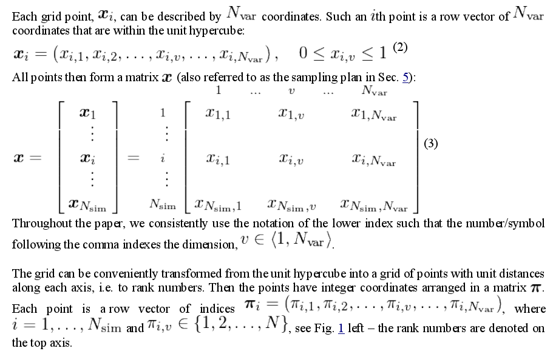
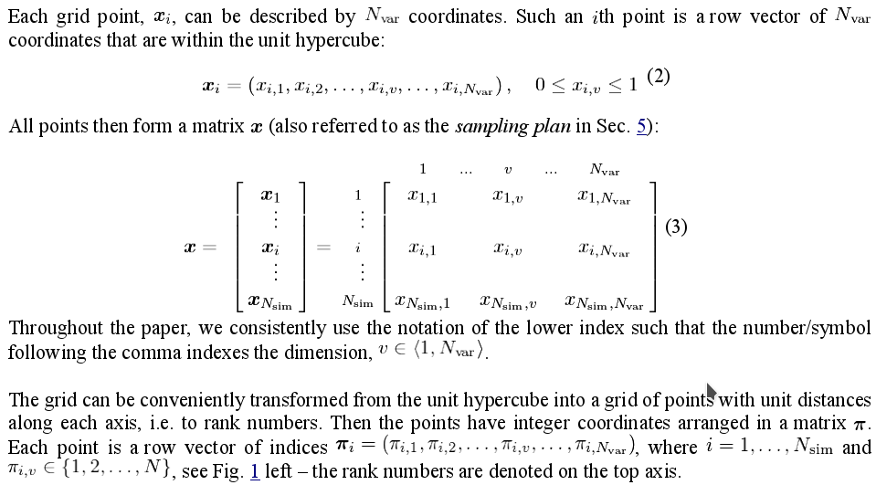

# Pdflatex to Word
- convert all figs to eps
- convertPDFtoEPS.py converts all pdf to eps
- for other formats use e.g. `$ convert figure.png figure.eps`

```bash
$ python convertPDFtoEPS.py
$ htlatex main.tex main.cfg
```
- cfg - all math as images


```bash
$ python3 main.py
```
- main.py add width and height in Math (line math $...$, display math)



- open in libreOffice, Tools > Links > Break links   and save as docx
